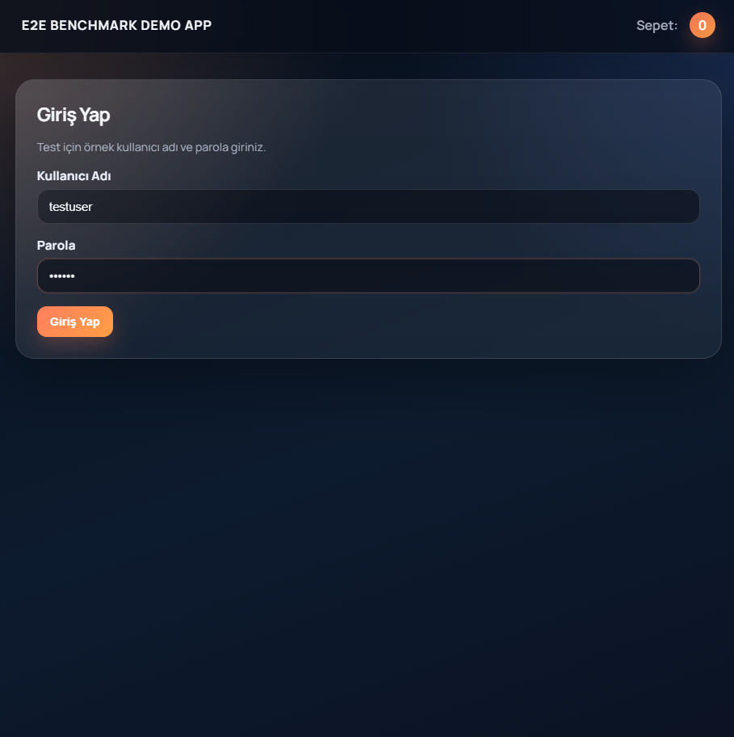
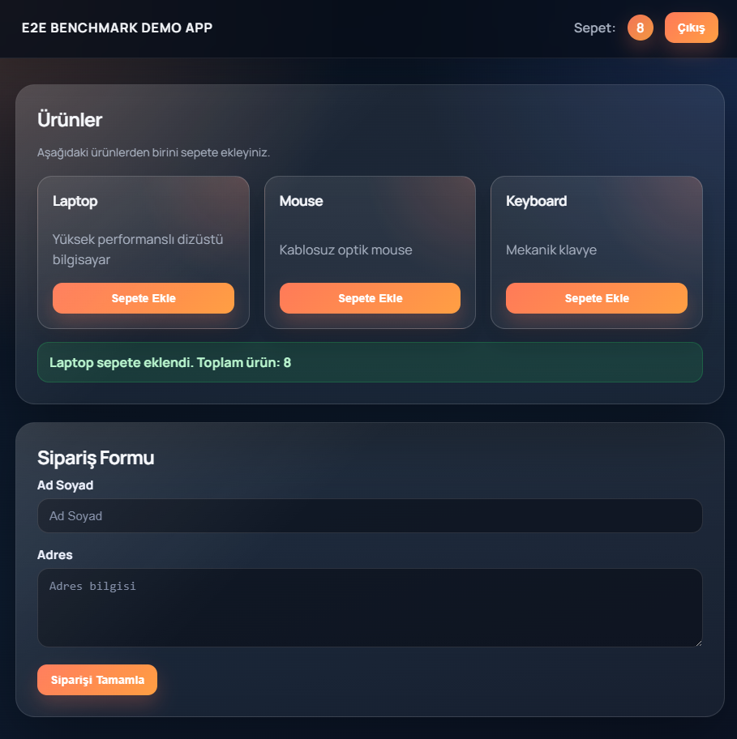
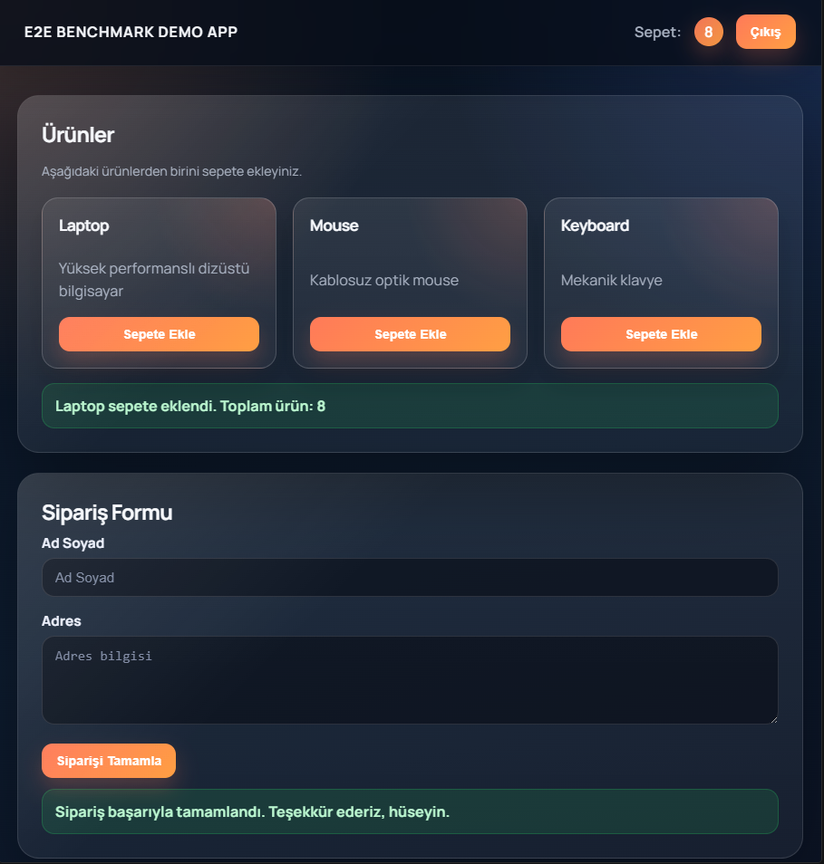
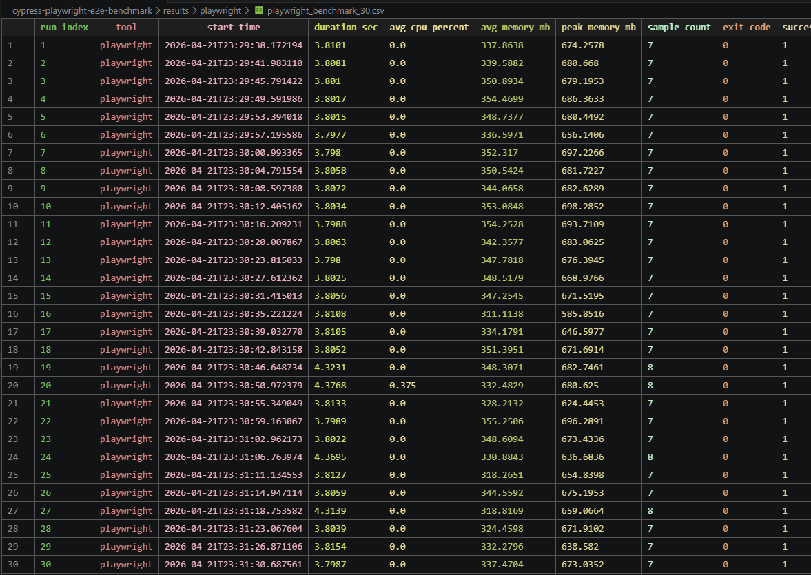
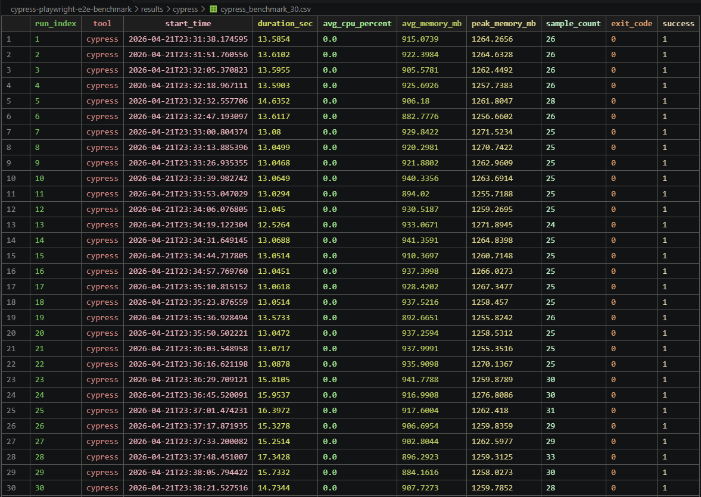

# Cypress vs Playwright E2E Benchmark

Bu depo, aynı demo uygulama üzerinde **Cypress** ve **Playwright** ile yazılmış uçtan uca testlerin performansını karşılaştırmak için hazırlanmış bir benchmark çalışmasıdır.

Çalışmanın ana odağı sadece testlerin "geçmesi" değildir. Asıl amaç, iki aracın aynı kullanıcı akışlarında:

- çalışma süresi
- bellek tüketimi
- tekrarlar arasındaki kararlılık
- ölçüm çıktılarının raporlanabilirliği

gibi boyutlarda nasıl davrandığını görünür hale getirmektir.

## Kısa Özet

Projede üç temel kullanıcı akışı test edilir:

1. giriş yapma
2. ürünü sepete ekleme
3. siparişi tamamlama

Bu akış hem Cypress hem de Playwright tarafında eşdeğer şekilde koşturulur. Ardından 30 tekrar üzerinden ölçüm alınır ve CSV raporlarına yazılır.

Benchmark özetine göre:

| Araç | Başarılı Çalışma | Ortalama Süre | Ortalama Bellek | Tepe Bellek |
|---|---:|---:|---:|---:|
| Playwright | 30 / 30 | 3.8769 sn | 340.8204 MB | 698.2852 MB |
| Cypress | 30 / 30 | 13.9360 sn | 918.6872 MB | 1276.8086 MB |

Bu sonuçlar, bu projedeki demo senaryosu özelinde Playwright’ın daha hızlı ve daha hafif çalıştığını gösterir.

## Repo Yapısı

```text
app/                Demo uygulamanın HTML sayfası
cypress/            Cypress testleri
playwright-tests/   Playwright testleri
scripts/            Benchmark ve raporlama scriptleri
results/            CSV sonuçları ve özetler
docs/               Çalışma notları, loglar ve başarı ekran görüntüleri
screenshots/        Test akışına ait görseller ve benchmark çıktıları
```

## Demo Uygulama

Testlerin çalıştığı örnek uygulama `app/index.html` içinde yer alır. Uygulama, benchmark için özellikle basit tutulmuştur ve şu etkileşimleri içerir:

- kullanıcı adı ve parola ile giriş
- ürün kartları üzerinden sepete ürün ekleme
- sipariş formu doldurma
- siparişi tamamlama mesajını doğrulama

Bu sade akış, iki test aracını aynı koşullarda karşılaştırmayı kolaylaştırır.

## Test Akışı

Testlerde sırasıyla şu davranışlar doğrulanır:

1. Demo uygulama açılır.
2. Kullanıcı bilgileri ile giriş yapılır.
3. Ürünler arasından bir öğe sepete eklenir.
4. Sipariş formu doldurulur.
5. Siparişin başarıyla tamamlandığı mesajı kontrol edilir.

`docs/test-log.md` içindeki notlara göre her iki framework de bu akışı başarıyla tamamlamıştır ve her biri 3 test geçmiştir.

## Görsel Kanıtlar

### Demo Uygulama Ekranları

`screenshots/demoapp1.png`



`screenshots/demoapp2.png`



`screenshots/demoapp3.png`



Bu üç görüntü, testin uçtan uca iş akışını belgeliyor:

- ilk görsel giriş ekranını
- ikinci görsel sepete ürün eklenmesi ve form alanlarını
- üçüncü görsel ise başarı mesajı ile tamamlanan sipariş durumunu

### Benchmark Çıktıları

`screenshots/playwright30.png`



`screenshots/cypress30.png`



Bu ekranlar, 30 tekrar üzerinden alınan ham ölçüm satırlarını gösterir. Özet CSV dosyaları da bu ham verilerden üretilmiştir.

## Sonuç Dosyaları

`results/` klasörü benchmark çıktılarının toplandığı yerdir.

- `results/playwright/playwright_benchmark_30.csv`: Playwright için ham tekrar ölçümleri
- `results/cypress/cypress_benchmark_30.csv`: Cypress için ham tekrar ölçümleri
- `results/summaries/benchmark_summary_30.csv`: iki aracın karşılaştırmalı özeti

Özet CSV’den görülen temel metrikler:

- Playwright: 30/30 başarılı, ortalama süre 3.8769 sn, ortalama bellek 340.8204 MB
- Cypress: 30/30 başarılı, ortalama süre 13.9360 sn, ortalama bellek 918.6872 MB

## Loglar ve Raporlar

`docs/` klasörü, çalışmanın okunmasını kolaylaştıran destek dosyalarını içerir:

- `docs/cypress-test-output.txt`: Cypress test çıktısı
- `docs/playwright-test-output.txt`: Playwright test çıktısı
- `docs/cypress-benchmark-30.log`: Cypress benchmark kayıtları
- `docs/playwright-benchmark-30.log`: Playwright benchmark kayıtları
- `docs/test-log.md`: çalışmanın kısa operasyonel özeti

Bu dosyalar, yalnızca sonuçları değil, sonucun nasıl oluştuğunu da takip etmeyi kolaylaştırır.

## Kurulum

Projeyi çalıştırmak için Node.js tabanlı bağımlılıkların kurulması gerekir:

```bash
npm install
```

Playwright tarafında tarayıcıların ayrıca kurulması gerekiyorsa:

```bash
npx playwright install
```

## Çalıştırma

### Playwright testi

```bash
npm run test:playwright
```

### Cypress testi

```bash
npm run test:cypress
```

## Benchmark Üretimi

Benchmark ve özet raporlar `scripts/` klasöründeki Python scriptleri ile üretilir:

- `scripts/benchmark.py`
- `scripts/summarize_results.py`
- `scripts/run-cypress.js`

Özet oluşturma mantığı, ham CSV dosyalarını okuyup başarı sayısı, süre ortalaması ve bellek istatistiklerini tek bir karşılaştırma tablosuna dönüştürmektir.

## Raporun Yorumlanması

Bu çalışmada iki noktaya özellikle dikkat etmek gerekir:

1. **Başarı oranı eşit**: Her iki araç da 30 denemenin 30’unu başarıyla tamamlamıştır.
2. **Kaynak kullanımı farklı**: Aynı akışta Cypress, Playwright’a göre daha uzun sürmüş ve daha fazla bellek tüketmiştir.

Bu nedenle bu depo, yalnızca "hangi araç daha hızlı" sorusuna değil, aynı zamanda "aynı kullanıcı akışında hangi araç daha verimli raporlanıyor" sorusuna da veri sağlar.

## Not

Buradaki sonuçlar bu depo içindeki demo uygulama, test senaryoları ve ölçüm yöntemi için geçerlidir. Gerçek projelerde uygulama karmaşıklığı, ağ gecikmesi, fixture yapısı ve test mimarisi bu değerleri ciddi biçimde değiştirebilir.
