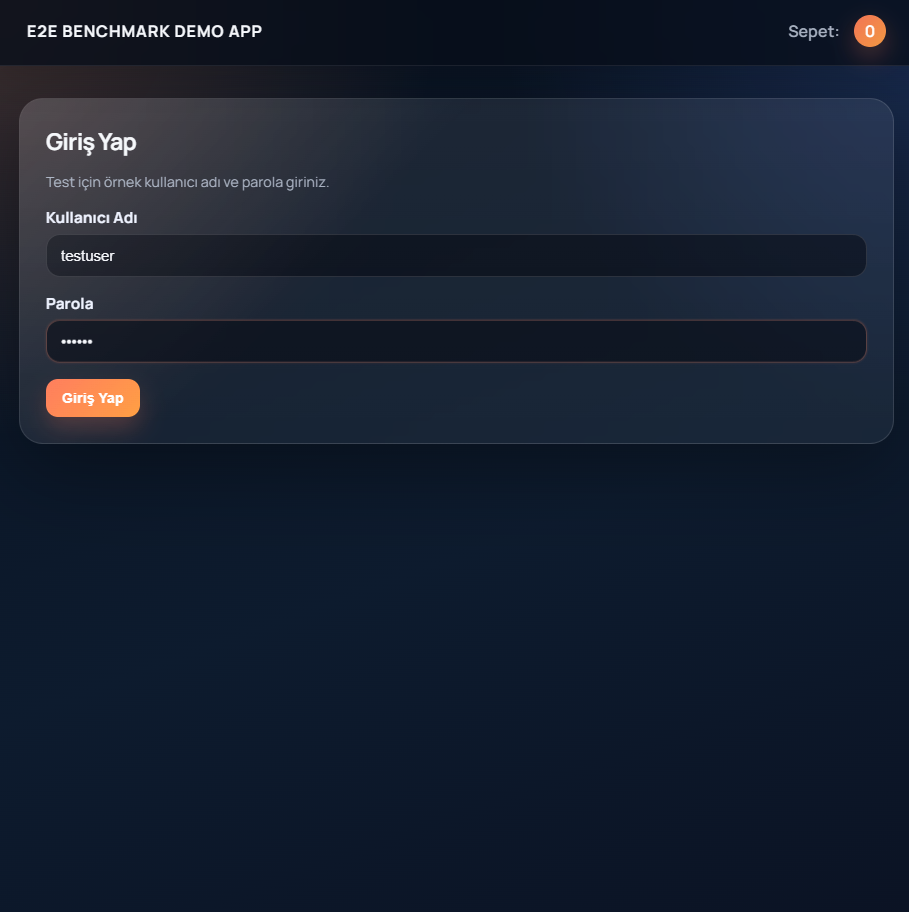
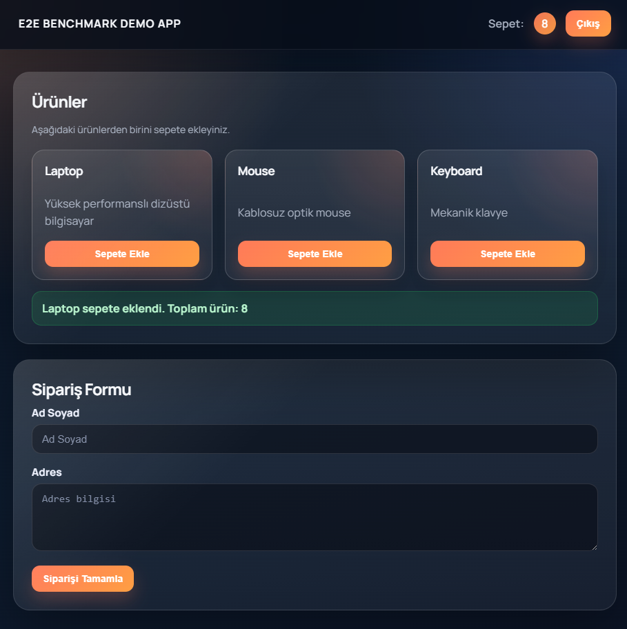
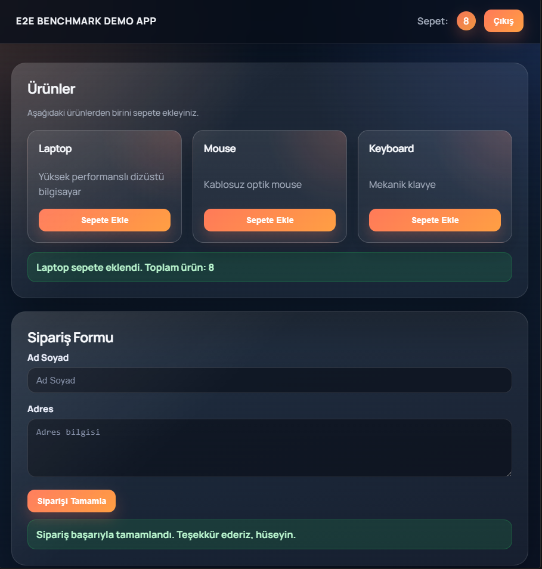
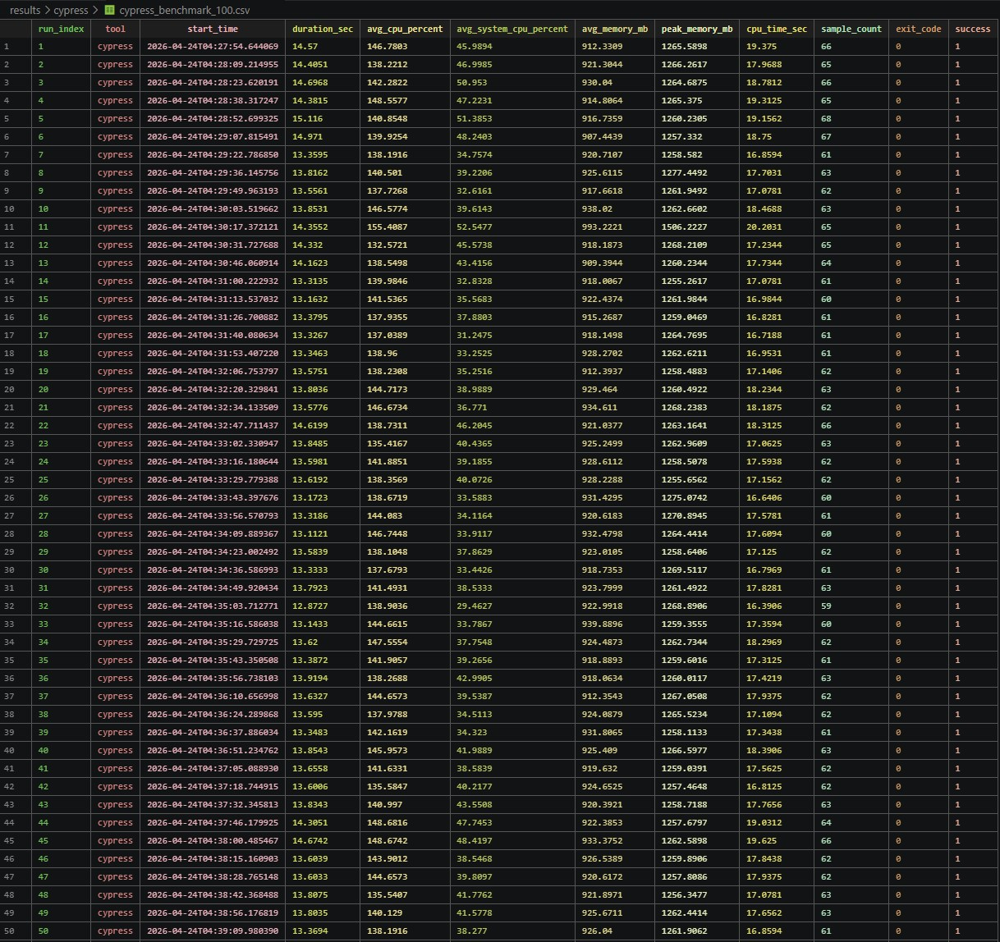
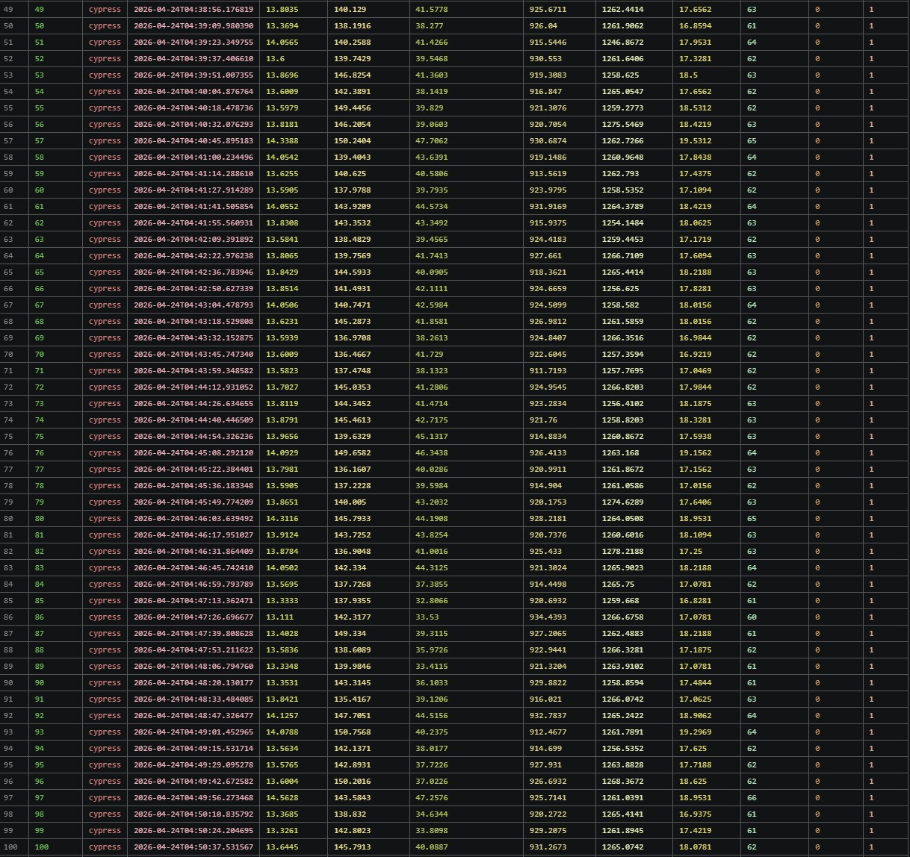
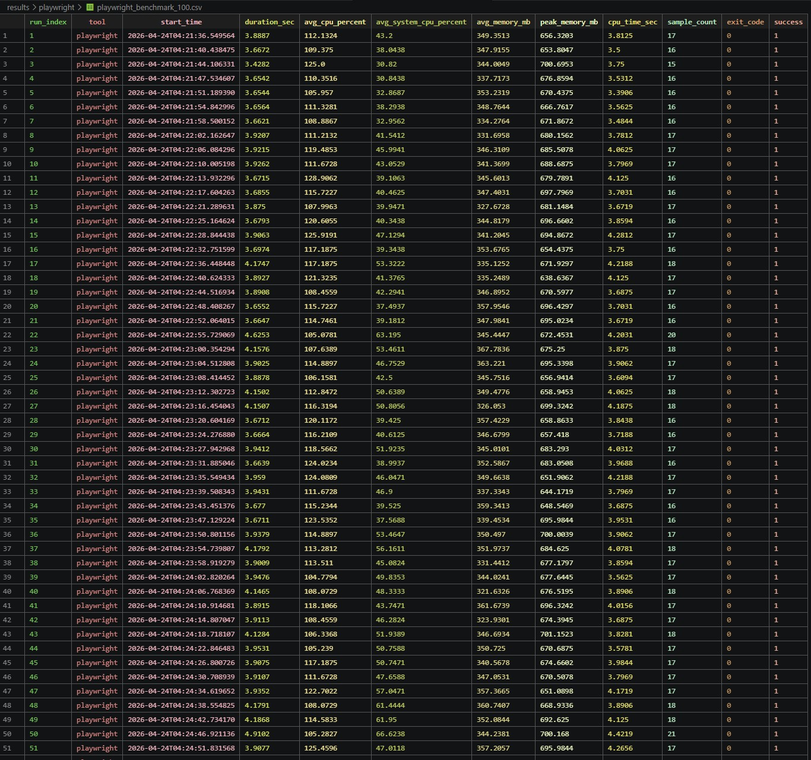
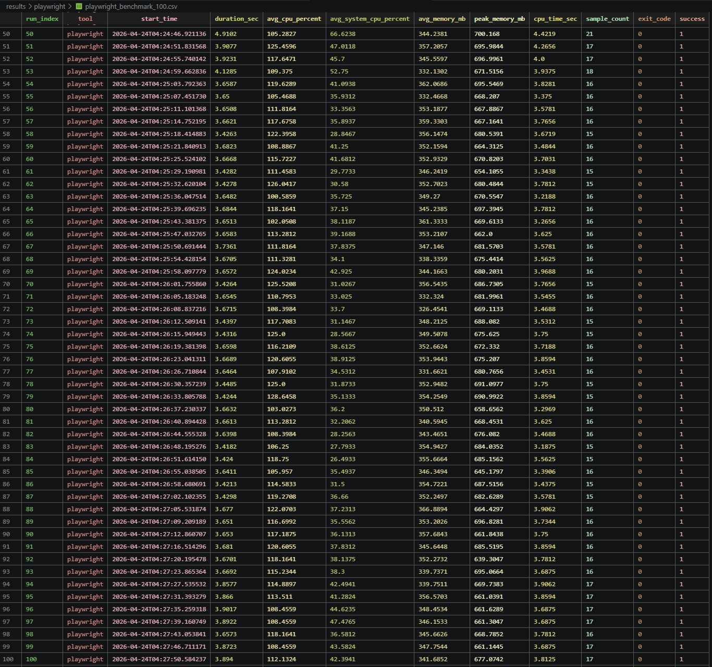

# Cypress vs Playwright E2E Benchmark

Bu depo, aynı demo uygulama üzerinde **Cypress** ve **Playwright** ile yazılmış uçtan uca testlerin performansını karşılaştırmak için hazırlanmış bir benchmark çalışmasıdır.

Çalışmanın ana odağı sadece testlerin "geçmesi" değildir. Asıl amaç, iki aracın aynı kullanıcı akışlarında:

- çalışma süresi
- bellek tüketimi
- tekrarlar arasındaki kararlılık
- ölçüm çıktılarının raporlanabilirliği

gibi boyutlarda nasıl davrandığını görünür hale getirmektir.

## Kısa Özet

Projede üç temel kullanıcı akışı, baseline işlevsel kullanıcı akışı kapsamında test edilir:

1. giriş yapma
2. ürünü sepete ekleme
3. siparişi tamamlama

Bu baseline akış hem Cypress hem de Playwright tarafında eşdeğer şekilde koşturulur. Ardından 100 tekrar üzerinden ölçüm alınır ve CSV raporlarına yazılır.

Benchmark özetine göre:

| Araç | Başarılı Çalışma | Ortalama Süre | Ortalama CPU | Ortalama Bellek | Tepe Bellek |
|---|---:|---:|---:|---:|---:|
| Playwright | 100 / 100 | 3.7790 sn | 114.4989 % | 347.2740 MB | 701.1523 MB |
| Cypress | 100 / 100 | 13.7650 sn | 141.8972 % | 923.5276 MB | 1506.2227 MB |

Bu sonuçlar, bu projedeki demo senaryosu özelinde Playwright’ın daha hızlı ve daha hafif çalıştığını gösterir.

## Repo Yapısı

```text
app/                Demo uygulamanın HTML sayfası
cypress/            Cypress testleri
playwright-tests/   Playwright testleri
scripts/            Benchmark ve raporlama scriptleri
results/            CSV sonuçları ve özetler
docs/               Çalışma notları, loglar ve başarı ekran görüntüleri
screenshots/        Test akışına ait görseller ve benchmark çıktıları
```

## Demo Uygulama

Testlerin çalıştığı örnek uygulama `app/index.html` içinde yer alır. Uygulama, benchmark için özellikle basit tutulmuştur ve şu etkileşimleri içerir:

- kullanıcı adı ve parola ile giriş
- ürün kartları üzerinden sepete ürün ekleme
- sipariş formu doldurma
- siparişi tamamlama mesajını doğrulama

Bu sade akış, iki test aracını aynı koşullarda karşılaştırmayı kolaylaştırır.

## Test Akışı

Bu depoda korunan baseline testler şunlardır:

- başarılı sipariş akışı
- geçersiz giriş
- boş sepetle sipariş

Başarılı sipariş akışında sırasıyla şu davranışlar doğrulanır:

1. Demo uygulama açılır.
2. Kullanıcı bilgileri ile giriş yapılır.
3. Ürünler arasından bir öğe sepete eklenir.
4. Sipariş formu doldurulur.
5. Siparişin başarıyla tamamlandığı mesajı kontrol edilir.

`docs/test-log.md` içindeki notlara göre baseline akışı ve profil testleri her iki framework tarafında da başarılı şekilde geçmektedir.

Ek olarak demo uygulamada şu profil testleri bulunur:

- UI-heavy profil testi
- CPU-heavy profil testi
- RAM-heavy profil testi

## Görsel Kanıtlar

### Demo Uygulama Ekranları

`screenshots/demoapp1.png`



`screenshots/demoapp2.png`



`screenshots/demoapp3.png`



Bu üç görüntü, testin uçtan uca iş akışını belgeliyor:

- ilk görsel giriş ekranını
- ikinci görsel sepete ürün eklenmesi ve form alanlarını
- üçüncü görsel ise başarı mesajı ile tamamlanan sipariş durumunu
 
### Ek Görseller

`screenshots/cypress050.jpg`



`screenshots/cypress50100.jpg`



`screenshots/playwright050.jpg`



`screenshots/playwright50100.jpg`



### Benchmark Çıktıları

Bu bölümdeki referanslar, geçmiş benchmark çıktılarının nasıl arşivlendiğini gösterir. Güncel benchmark sonuçları 100 tekrar üzerinden üretilmiştir ve esas alınması gereken CSV dosyalar `results/` altındadır.

## Sonuç Dosyaları

`results/` klasörü benchmark çıktılarının toplandığı yerdir.

- `results/playwright/playwright_benchmark_100.csv`: Playwright için ham tekrar ölçümleri
- `results/cypress/cypress_benchmark_100.csv`: Cypress için ham tekrar ölçümleri
- `results/summaries/benchmark_summary_100.csv`: iki aracın karşılaştırmalı özeti
- `results/thesis_stats_report_100.md`: tez için hazırlanmış analiz raporu

Özet CSV’den görülen temel metrikler:

- Playwright: 100/100 başarılı, ortalama süre 3.7790 sn, ortalama CPU 114.4989 %, ortalama bellek 347.2740 MB
- Cypress: 100/100 başarılı, ortalama süre 13.7650 sn, ortalama CPU 141.8972 %, ortalama bellek 923.5276 MB

## Profil Laboratuvarı

Demo uygulamada baseline işlevsel kullanıcı akışından ayrı olarak üç profil alanı bulunur:

- UI-heavy profil yapısı
- CPU-heavy profil yapısı
- RAM-heavy profil yapısı

Bu profiller test edilebilir `data-testid` seçicileri ile birlikte gelir ve baseline benchmark sonuçlarını değiştirmez. Güncel CSV özetleri hâlâ yalnızca baseline işlevsel kullanıcı akışı için geçerlidir.

## Loglar ve Raporlar

`docs/` klasörü, çalışmanın okunmasını kolaylaştıran destek dosyalarını içerir:

- `docs/cypress-test-output.txt`: Cypress test çıktısı
- `docs/playwright-test-output.txt`: Playwright test çıktısı
- `docs/cypress-benchmark-100.log`: Cypress benchmark kayıtları
- `docs/playwright-benchmark-100.log`: Playwright benchmark kayıtları
- `docs/test-log.md`: çalışmanın kısa operasyonel özeti

Bu dosyalar, yalnızca sonuçları değil, sonucun nasıl oluştuğunu da takip etmeyi kolaylaştırır.

## Kurulum

Projeyi çalıştırmak için Node.js tabanlı bağımlılıkların kurulması gerekir:

```bash
npm install
```

Playwright tarafında tarayıcıların ayrıca kurulması gerekiyorsa:

```bash
npx playwright install
```

## Çalıştırma

### Playwright testi

```bash
npm run test:playwright
```

### Cypress testi

```bash
npm run test:cypress
```

### Profil Bazlı Test Komutları

Playwright:

```bash
npm run test:playwright:baseline
npm run test:playwright:ui-heavy
npm run test:playwright:cpu-heavy
npm run test:playwright:ram-heavy
```

Cypress:

```bash
npm run test:cypress:baseline
npm run test:cypress:ui-heavy
npm run test:cypress:cpu-heavy
npm run test:cypress:ram-heavy
```

## Benchmark Üretimi

Benchmark ve özet raporlar `scripts/` klasöründeki Python scriptleri ile üretilir:

- `scripts/benchmark.py`
- `scripts/summarize_results.py`
- `scripts/run-cypress.js`
- `scripts/analyze_stats_for_thesis.py`

Profil bazlı özet, karşılaştırma ve grafik üretimi için:

```bash
npm run analyze:profiles
```

Bu analiz, `results/{tool}/{profile}_benchmark_100.csv` dosyalarını okuyarak `results/summaries/profile_metric_summary.csv`, `results/summaries/profile_comparison_stats.csv` ve `results/graphs/` altında profil bazlı çıktılar üretir.

Profil bazlı benchmark koşularını tek seferde üretmek için:

```bash
npm run benchmark:all
```

Bu komut, Playwright ve Cypress için `baseline`, `ui-heavy`, `cpu-heavy` ve `ram-heavy` profillerinin tamamını 100 tekrar çalıştırır ve çıktıları `results/{tool}/{profile}_benchmark_100.csv` biçiminde yazar.

Özet oluşturma mantığı, ham CSV dosyalarını okuyup başarı sayısı, süre ortalaması, CPU ortalaması ve bellek istatistiklerini tek bir karşılaştırma tablosuna dönüştürmektir.

## Raporun Yorumlanması

Bu çalışmada iki noktaya özellikle dikkat etmek gerekir:

1. **Başarı oranı eşit**: Her iki araç da 100 denemenin 100’ünü başarıyla tamamlamıştır.
2. **Kaynak kullanımı farklı**: Aynı akışta Cypress, Playwright’a göre daha uzun sürmüş ve daha fazla bellek tüketmiştir.

Bu nedenle bu depo, yalnızca "hangi araç daha hızlı" sorusuna değil, aynı zamanda "aynı kullanıcı akışında hangi araç daha verimli raporlanıyor" sorusuna da veri sağlar.

## Not

Buradaki sonuçlar bu depo içindeki demo uygulama, test senaryoları ve ölçüm yöntemi için geçerlidir. Gerçek projelerde uygulama karmaşıklığı, ağ gecikmesi, fixture yapısı ve test mimarisi bu değerleri ciddi biçimde değiştirebilir.
